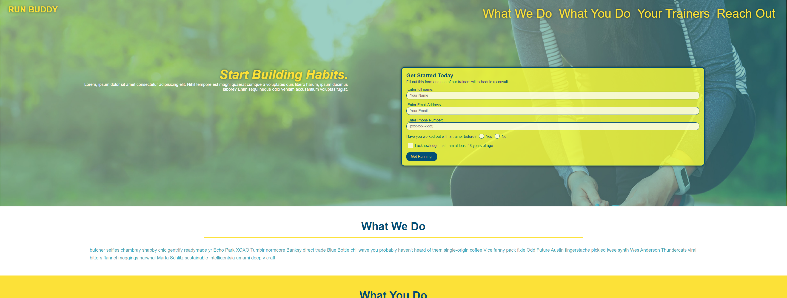

<!---
nitrotap/nitrotap is a ✨ special ✨ repository because its `README.md` (this file) appears on your GitHub profile.
You can click the Preview link to take a look at your changes.
- 💞️ I’m looking to collaborate on ...
  --->

# nitrotap

Hi, I'm Kartik (@nitrotap)!   
I’m interested in data entry, android app development, and full stack web development. I’m currently learning Java on HyperSkill, and I'm enrolled in the University of Minnesota Coding Bootcamp. (Finishing June 2022)

This project is designed to act as a personal portfolio.    
[View My Portfolio](https://nitrotap.github.io/nitrotap/)

My projects include:   
[Run Buddy](https://nitrotap.github.io/run-buddy/)   
   

[SEO Website](https://nitrotap.github.io/seo-site/)   
   

Reach out to me about Java, Full Stack Web Development, and Raspberry Pi.   
Thanks for stopping by :)

&copy; Kartik Jevaji